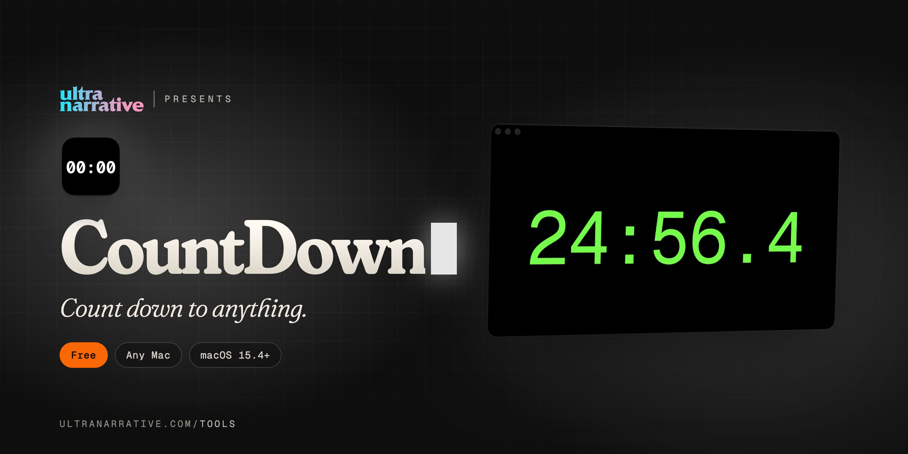

  

# CountDown

**Count down to anything.**

*Dan Rodriguez · [UltraNarrative](https://www.ultranarrative.com) · [ultranarrative.com/tools](https://www.ultranarrative.com/tools) · [dan@ultranarrative.com](mailto:dan@ultranarrative.com) · October 2026*

---

A countdown to any date and time, a Pomodoro timer for focused work, presets, alarm sounds and a background of your own.

Free, for any Mac, Apple silicon or Intel, macOS 15.4 or later. This repository holds the installer only. More free apps at [ultranarrative.com/tools](https://www.ultranarrative.com/tools).

## Download

[CountDown-mac-universal.dmg](https://github.com/ultranarrative/countdown-releases/releases/latest/download/CountDown-mac-universal.dmg)

This link always points to the newest version.

## Opening it the first time

I sign CountDown myself rather than through Apple, so macOS asks once. Open the disk image, drag CountDown to Applications and open it. When macOS stops it, go to System Settings, then Privacy & Security, and click Open Anyway.

## Support

CountDown is free, with no account and no subscription. If it helps you, [buy me a coffee](https://ko-fi.com/danrsuarez).

Made by Dan Rodriguez at [UltraNarrative](https://ultranarrative.com). © 2026 UltraNarrative. All rights reserved.
